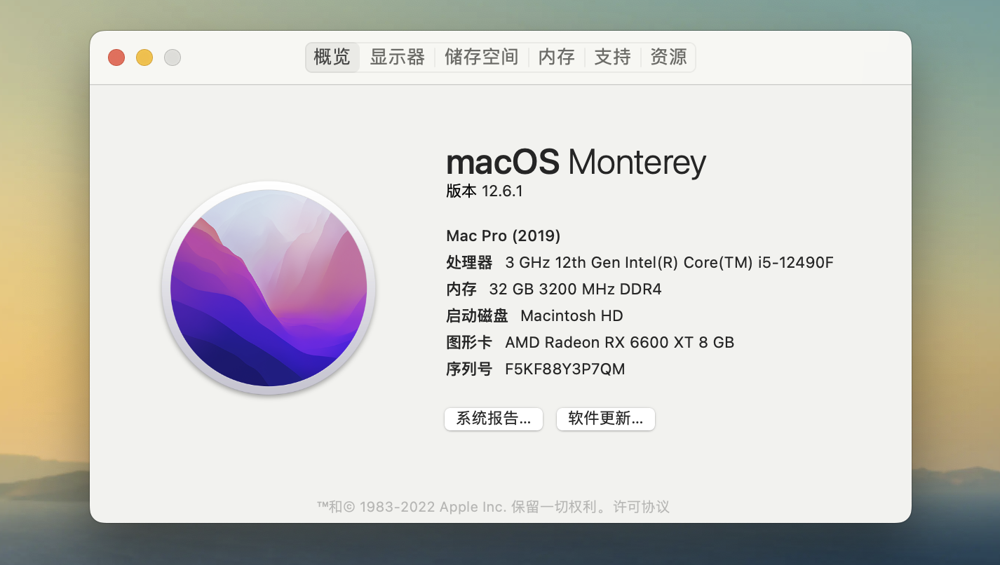
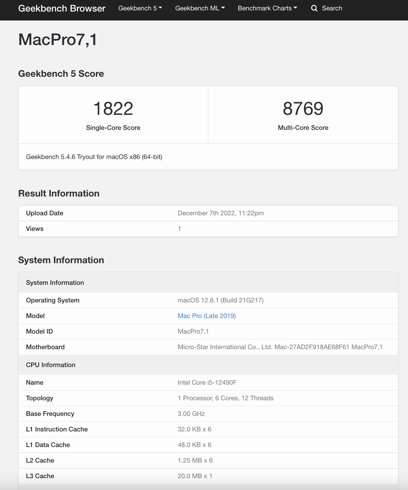
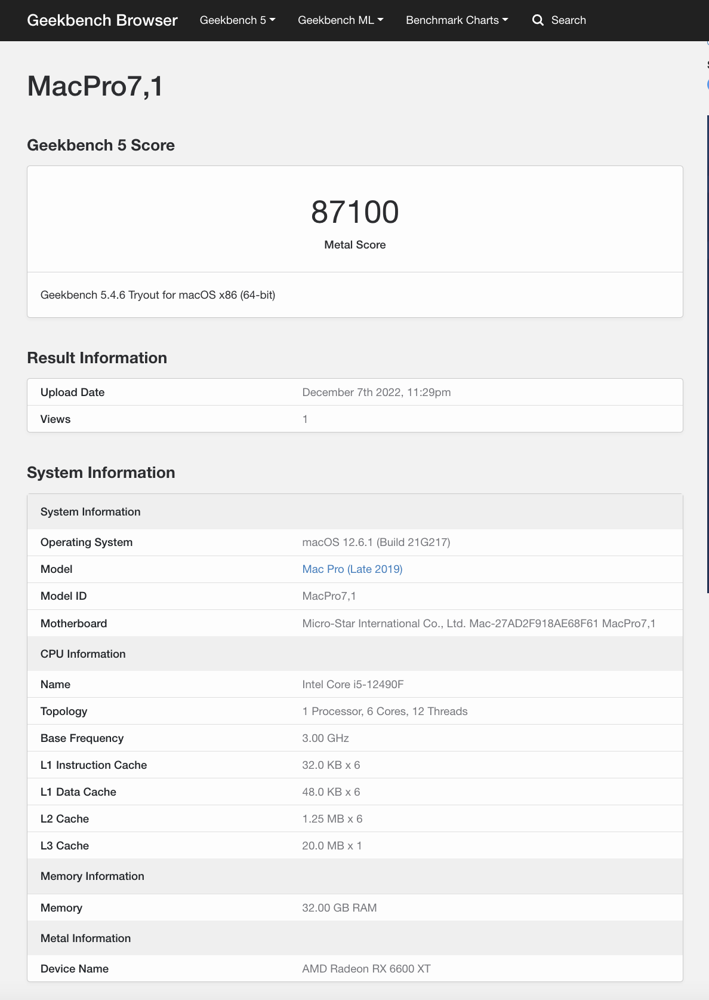
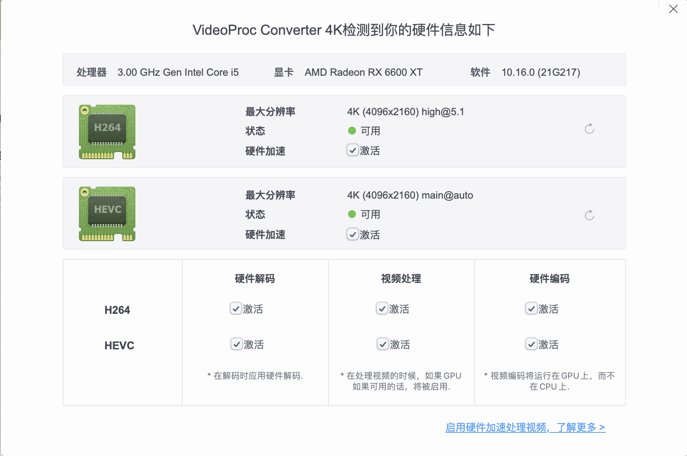

# Hackintosh-12490F-B660M-MORTAR-6600XT

适用于 12490F + B660M迫击炮 DDR4 + RX6600XT 黑苹果引导文件

基于 OpenCore 0.8.6 版本，机型 MacPro 7,1，系统 MacOS 12.6.1

# 本机配置

| 配置        | 型号                                                   |
|-----------|------------------------------------------------------|
| CPU       | intel i5-12490F                   |
| 主板        | MSI MAG B660M MORTAR DDR4   |
| 显卡        | 撼迅 AMD Radeon RX 6600XT 8G 红魔 |
| 内存        | 阿斯加特弗雷 DDR4 3200MHz 16G * 2   |
| SSD       |  影驰 M.2 512G NVME SSD PCIE 4.0         |
| 机箱        | 先马平头哥mini mATX           |
| 电源        | 振华冰山金蝶战斗版 550w 金牌ATX电源          |
| CPU 风扇    | 利民 AR120 SE                                          |
| WiFi + 蓝牙 | BCM94360CS2 双频+蓝牙4.0       |

# 使用情况
-[x] cpu正常
-[x] 节能三项
-[x] 睡眠正常
-[x] 唤醒正常
-[x] usb2.0/3.0/3.2正常
-[x] 声卡正常
-[x] wifi正常
-[x] 蓝牙正常
-[x] Airdrop正常
-[ ] 随航不正常

# 避坑指南
### SSD
尽量选择 群联主控 的M2 SSD，而且尽量选择PCIE4.0。B660M都支持m2 pcie4.0了，为何你还要选择凯侠RC2.0 pcie3呢？

### 显卡选择
尽量选择RX6xxx系列，支持mac新的图形API Metal（类比Window的DX12），游戏或者3D制作上会更优。

# BIOS 配置

本引导适用于 B660M 迫击炮主板（支持一键黑苹果，即D.T.M），请将主板bios更新到最新版本：
### 禁用：

SETTING - 安全引导

OC - CPU特征 VT-D

### 开启：

BETA - D.T.M

BETA - SR-IOV Support

SETTING - ACPI - Re-Size BAR Support

# 性能表现
## CPU:

## GPU:

